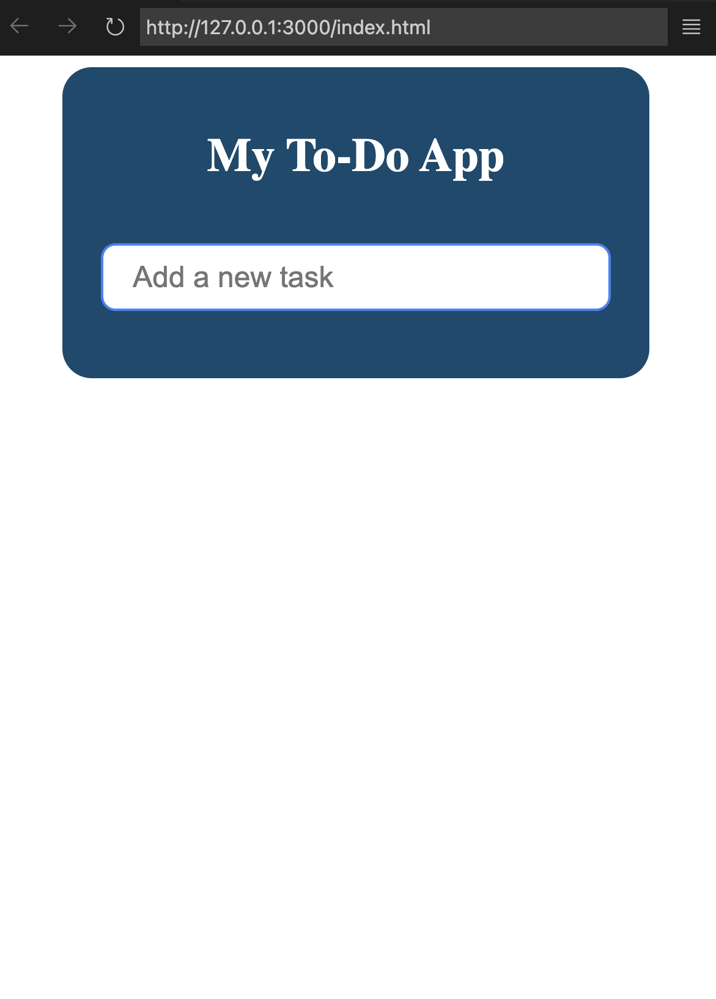

# To-Do App

This is a simple To-Do App built using HTML, CSS, and JavaScript. It allows users to manage their tasks by adding, marking as completed, and deleting tasks.

## Features

- Add new tasks with a task name input field.
- Mark tasks as completed or uncompleted by clicking on them.
- Delete tasks individually.
- Responsive design for various screen sizes.

## Usage

1. Clone the repository to your local machine:

```bash
git clone https://github.com/your-username/todo-app.git
```

2. Open the `index.html` file in your web browser to use the app.

## Screenshots




## File Structure

```
todo-app/
│
├── index.html
├── style.css
├── script.js
├── README.md
└── screenshots/
    ├── screenshot1.png
    └── screenshot2.png
```

## Contributing

Contributions are welcome! If you find any bugs or have suggestions for improvements, please open an issue or submit a pull request.

## License

This project is licensed under the Tabrej Alam.
EOF
